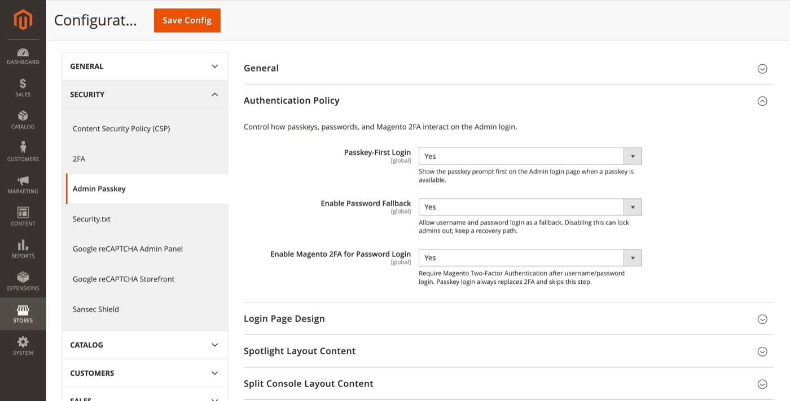

# Authentication Policy

Control how passkeys, passwords, and Magento 2FA interact on Admin login.

**Path:** Stores → Configuration → Security → Admin Passkey → **Authentication Policy**

## Settings

### Passkey-first login

When **Yes**, the Admin login page shows the passkey prompt first when a passkey is available for the browser (discoverable credential flow). Admins can still switch to the password tab.

### Enable password fallback

When **Yes**, username and password login remains available as a fallback.

> Disabling password fallback can lock admins out if all passkeys are lost. Always keep [Recovery](recovery.md) enabled or maintain a break-glass procedure before turning this off.

### Enable Magento 2FA for password login

When **Yes**, Magento Two-Factor Authentication is required after a successful username/password login.

**Important:** Passkey login always replaces 2FA and skips this step. Passkeys provide phishing-resistant multi-factor authentication by design.

## Login flow summary

| Method | Username | Password | Magento 2FA |
|--------|----------|----------|-------------|
| Passkey | Not required | Not required | Skipped |
| Password fallback | Required | Required | Required (if enabled) |

## Related topics

- [Admin login](admin-login.md) — what admins see on the login page
- [WebAuthn](webauthn.md) — discoverable passkey settings (`Resident Key`)
