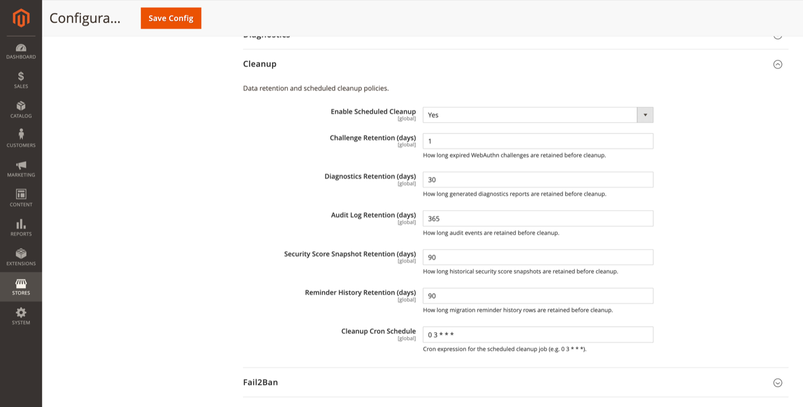

# Cleanup

Data retention policies and scheduled cleanup for module tables and generated artifacts.

**Path:** Stores → Configuration → Security → Admin Passkey → **Cleanup**



## Settings

| Field | Default | Description |
|-------|---------|-------------|
| Enable Scheduled Cleanup | Yes | Run the cleanup cron job. |
| Challenge Retention (days) | 1 | Expired WebAuthn challenges kept before deletion. |
| Diagnostics Retention (days) | 30 | Generated diagnostics reports kept before deletion. |
| Audit Log Retention (days) | 365 | Audit events kept before deletion. |
| Security Score Snapshot Retention (days) | 90 | Historical score snapshots kept before deletion. |
| Reminder History Retention (days) | 90 | Migration reminder history rows kept before deletion. |
| Cleanup Cron Schedule | `0 3 * * *` | Cron expression (default: daily at 03:00). |

## Admin UI

**System → Admin Passkey → Data Cleanup**

Uses the diagnostics ACL. Allows reviewing retention stats and triggering an on-demand cleanup run.

## CLI

```bash
bin/magento adminpasskey:cleanup
```

Runs the same cleanup logic as the cron job immediately.

## Compliance note

Audit log retention defaults to one year. Adjust **Audit Log Retention** to meet your organisation's compliance requirements before reducing it.

## Related topics

- [Diagnostics](diagnostics.md) — diagnostics file lifecycle
- [CLI commands](cli-commands.md) — manual cleanup
- [Audit log](admin-reports.md#audit-log) — what gets purged
