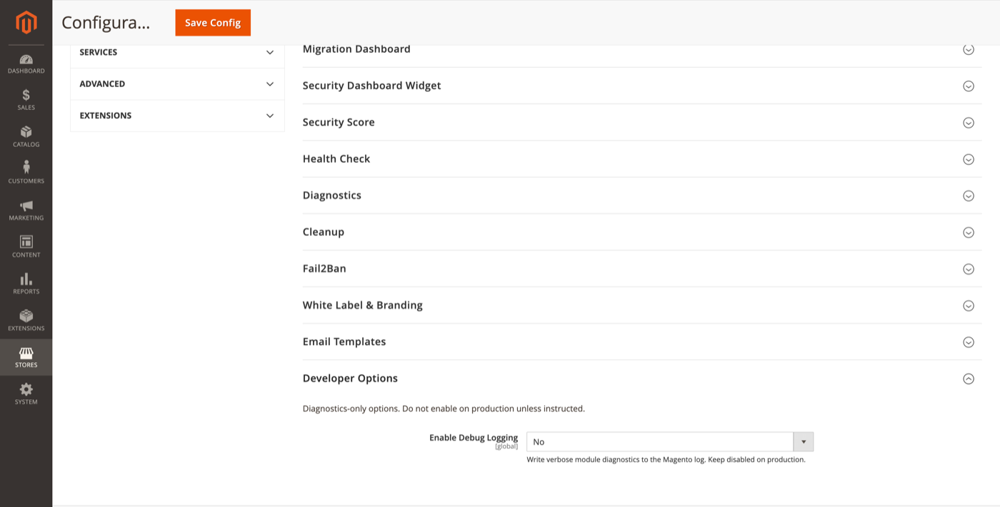

# Developer Options

Diagnostics-only settings. Do not enable on production unless instructed.

**Path:** Stores → Configuration → Security → Admin Passkey → **Developer Options**

## Settings

| Field | Default | Description |
|-------|---------|-------------|
| Enable Debug Logging | No | Write verbose module diagnostics to the Magento log (`var/log/system.log` / dedicated channel depending on version). |

## When to enable

- Reproducing WebAuthn ceremony failures locally
- Tracing onboarding redirect logic
- Support investigation alongside a [diagnostics](diagnostics.md) report

## Production warning

Verbose logging may include usernames, IP addresses, and ceremony metadata. Keep disabled on production under normal operation. Enable briefly, reproduce the issue, then disable and flush logs per your retention policy.

## Related topics

- [Diagnostics](diagnostics.md) — structured support bundle (preferred for tickets)
- [CLI commands](cli-commands.md) — `adminpasskey:health` without debug noise
- [Health check](health-check.md) — non-invasive configuration validation
