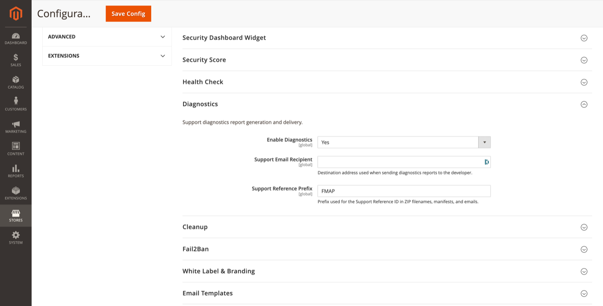

# Diagnostics

Support diagnostics report generation and delivery.

**Path:** Stores → Configuration → Security → Admin Passkey → **Diagnostics**



## Configuration

| Field | Default | Description |
|-------|---------|-------------|
| Enable Diagnostics | Yes | Allow generating diagnostics ZIP reports. |
| Support Email Recipient | *(empty)* | Destination when sending reports to the developer. |
| Support Reference Prefix | FMAP | Prefix for Support Reference IDs in filenames, manifests, and emails. |

## Admin UI

**Reports → Admin Passkey → Diagnostics**

ACL: `FalconMedia_AdminPasskey::diagnostics`

Generate a ZIP bundle containing:

- Redacted configuration snapshot
- Health check results
- Recent audit events (sanitised)
- Module version and environment metadata
- Support reference ID for ticket correlation

Reports can be downloaded or emailed when a support recipient is configured.

## CLI

```bash
bin/magento adminpasskey:diagnostics:generate
```

Creates a report on the filesystem and prints the path. Options may include `--email` to send immediately (see command help).

## Email

Uses the [Diagnostics report template](email-templates.md). The support confirmation template acknowledges receipt to the requesting admin.

## Data retention

Generated reports are purged per [Cleanup](cleanup.md) → Diagnostics Retention (default 30 days).

## Related topics

- [Health check](health-check.md) — included in the report
- [Developer options](developer-options.md) — additional verbose logging (separate from diagnostics bundle)
- [Data Cleanup admin page](admin-reports.md#data-cleanup) — manual cleanup triggers
