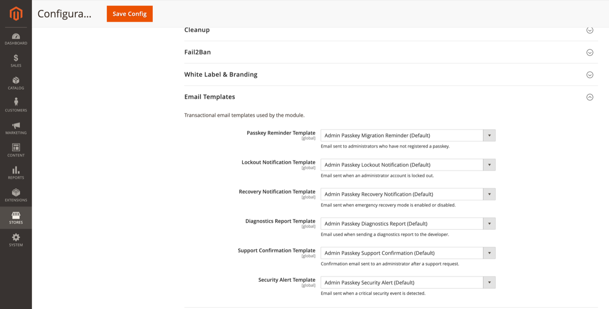

# Email Templates

Transactional email templates used by the module.

**Path:** Stores → Configuration → Security → Admin Passkey → **Email Templates**

Each field is a Magento email template selector. Default templates are installed with the module and can be duplicated under **Marketing → Email Templates** for customisation.

## Templates

| Config field | Default template | Sent when |
|--------------|------------------|-----------|
| Passkey Reminder Template | Admin Passkey Migration Reminder | Admin has not registered a passkey ([Migration dashboard](migration-dashboard.md)) |
| Lockout Notification Template | Admin Passkey Lockout Notification | Account locked after failed attempts ([Lockout](lockout.md)) |
| Recovery Notification Template | Admin Passkey Recovery Notification | Emergency [recovery](recovery.md) mode enabled or disabled |
| Diagnostics Report Template | Admin Passkey Diagnostics Report | [Diagnostics](diagnostics.md) ZIP emailed to support |
| Support Confirmation Template | Admin Passkey Support Confirmation | Admin submits a support / diagnostics request |
| Security Alert Template | Admin Passkey Security Alert | Critical security event detected |

## Customisation

1. Duplicate the default template in **Marketing → Email Templates**.
2. Edit HTML and subject line; use template variables documented in the template preview.
3. Select your custom template in Admin Passkey → Email Templates.
4. Save config and send a test (e.g. trigger a reminder from the migration dashboard).

## Sender identity

Emails use Magento's standard store email sender configuration (**Stores → Configuration → General → Store Email Addresses**), not the branding support email field.

## Related topics

- [Migration dashboard](migration-dashboard.md) — reminder emails
- [White label & branding](white-label-branding.md) — visual identity on login, not email headers
