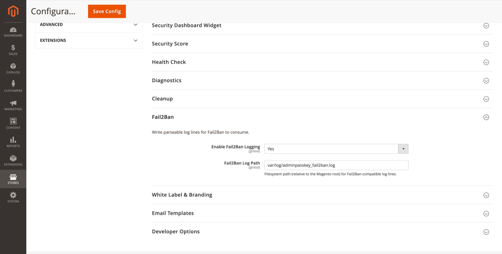

# Fail2Ban

Write parseable log lines for external Fail2Ban jails to consume.

**Path:** Stores → Configuration → Security → Admin Passkey → **Fail2Ban**

## Settings

| Field | Default | Description |
|-------|---------|-------------|
| Enable Fail2Ban Logging | Yes | Write Fail2Ban-compatible log entries on failed logins and lockouts. |
| Fail2Ban Log Path | `var/log/adminpasskey_fail2ban.log` | Path relative to the Magento root. |

## Log format

Each line is structured for easy parsing by Fail2Ban `filter.d` rules — typically including client IP, username (when known), event type, and timestamp.

Example use cases:

- Ban IPs after N failed passkey or password attempts within a window
- Alert on repeated lockout events from the same subnet

## Sample Fail2Ban setup

1. Enable logging in Admin Passkey config.
2. Create a filter pointing at `adminpasskey_fail2ban.log`.
3. Attach a jail with `logpath` set to `{magento_root}/var/log/adminpasskey_fail2ban.log`.
4. Reload Fail2Ban: `fail2ban-client reload`.

Exact filter regex depends on the log line format your module version emits — generate a test failure and inspect the log file before finalising the filter.

## Related topics

- [Lockout](lockout.md) — account-level throttling (complements IP-level Fail2Ban)
- [Cleanup](cleanup.md) — log rotation is handled by Magento/logrotate, not module cleanup
