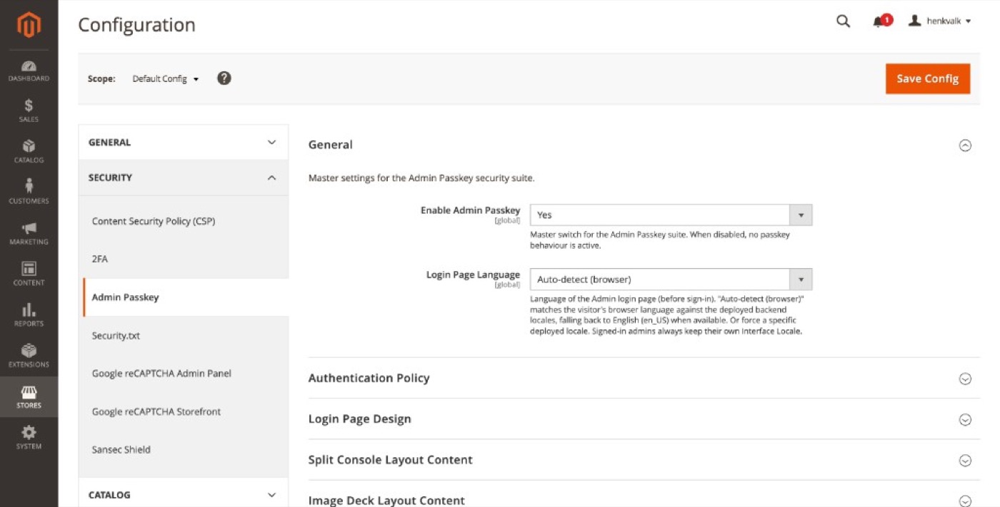

# General

Master settings for the Admin Passkey security suite.

**Path:** Stores → Configuration → Security → Admin Passkey → **General**

## Enable Admin Passkey

| Setting | Scope | Default |
|---------|-------|---------|
| Enable Admin Passkey | Global | Yes |

Master switch for the entire module. When set to **No**, no passkey behaviour is active: the custom login page, onboarding wizard, dashboard widget, and related features are disabled.

> Always keep a recovery path configured ([Recovery](recovery.md), password fallback) before disabling the module on production.

## Login Page Language

| Setting | Scope | Default |
|---------|-------|---------|
| Login Page Language | Global | Auto-detect (browser) |

Controls the language of the Admin **login page only** — before an administrator signs in.

| Option | Behaviour |
|--------|-----------|
| **Auto-detect (browser)** | Matches the visitor's browser `Accept-Language` header against deployed backend locales. Falls back to English (`en_US`) when no match is found. |
| **Specific locale** | Forces a fixed language from the same locale list used by **System → My Account → Interface Locale** (e.g. Dutch `nl_NL`, English `en_US`). |

Signed-in administrators always use their own **Interface Locale** from My Account. This setting does not change the Admin UI after login.

### When to force a locale

- Single-language team — pick the locale explicitly instead of relying on browser detection.
- Staging/demo environment — force English regardless of visitor browser settings.
- Leave on **Auto-detect** when admins may sign in from mixed locales and you deploy multiple backend language packs.

See [Admin login](admin-login.md) for how locale affects login labels (e.g. *Wachtwoord* vs *Password*).

## Related topics

- [Login page design](login-page-design.md) — layout and copy fields
- [Authentication policy](authentication-policy.md) — what happens when the module is enabled
- [Developer options](developer-options.md) — verbose logging for troubleshooting
