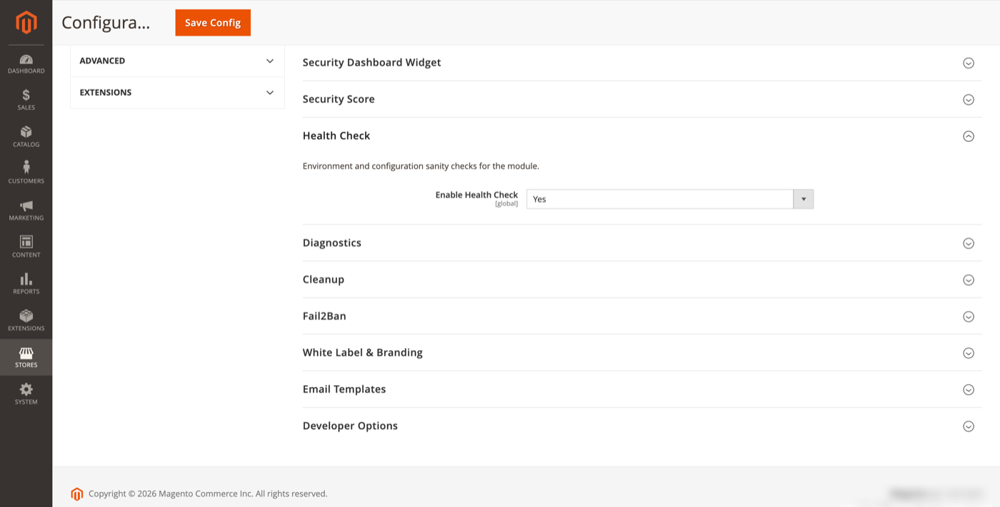

# Health Check

Environment and configuration sanity checks for the module.

**Path:** Stores → Configuration → Security → Admin Passkey → **Health Check**



## Configuration

| Field | Default | Description |
|-------|---------|-------------|
| Enable Health Check | Yes | Run configuration and environment checks. |

## Admin UI

**Reports → Admin Passkey → Health Check**

ACL: `FalconMedia_AdminPasskey::health`

The health check page runs automated tests such as:

- Module enabled and configuration readable
- WebAuthn rpId / origin derivability or explicit values valid
- HTTPS requirement for WebAuthn in production
- Database tables and indexes present
- Cron / cleanup schedule reachable
- Required PHP extensions and Magento modules available

Each check reports pass, warning, or fail with remediation hints.

## CLI

```bash
bin/magento adminpasskey:health
```

Exits non-zero when critical checks fail — suitable for deploy smoke tests.

## Dashboard integration

When enabled, the [Security dashboard widget](security-dashboard-widget.md) **Health Status** card reflects the latest health check summary.

## Related topics

- [WebAuthn](webauthn.md) — common source of health warnings
- [Diagnostics](diagnostics.md) — deeper support bundle when health check is insufficient
