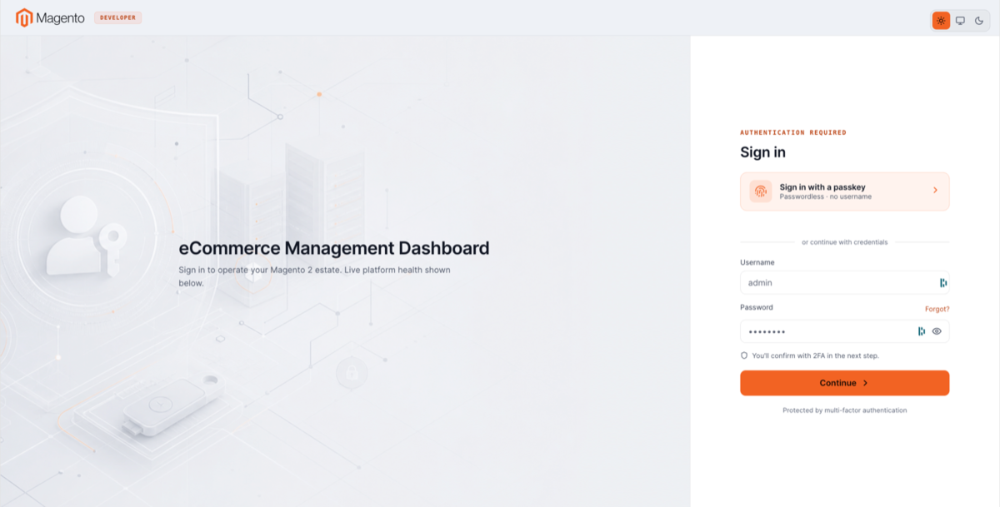
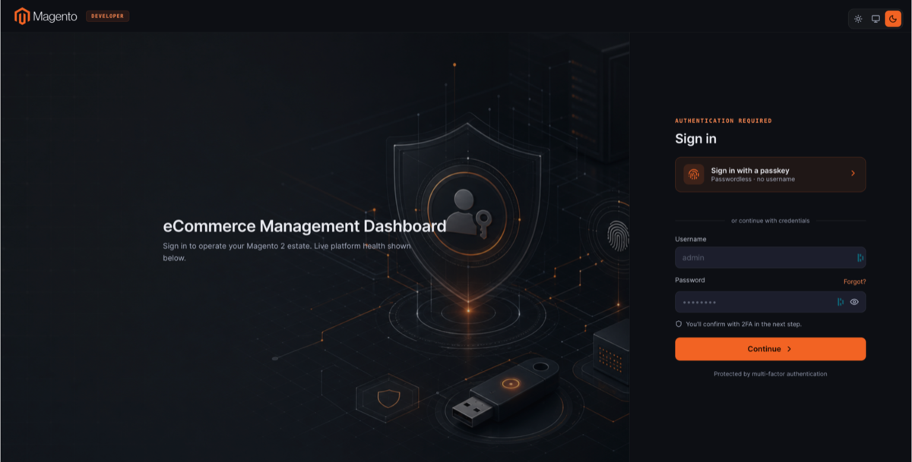
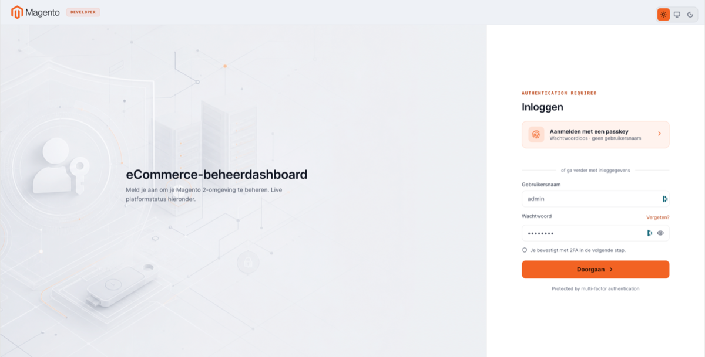
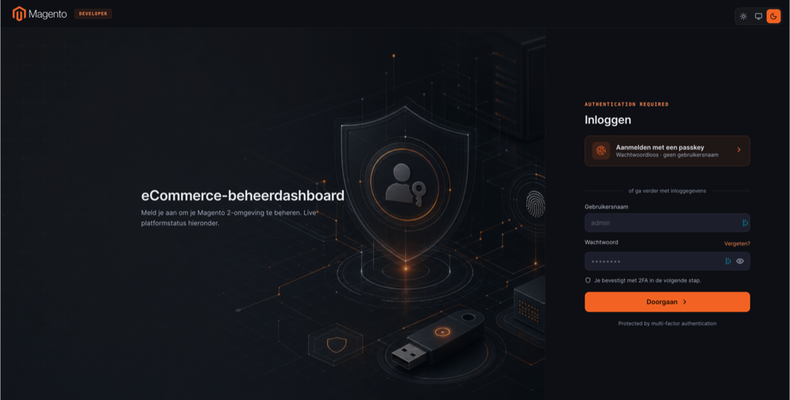

# Image Deck Layout

A two-column login layout with a configurable stage panel (background art) on the left and the authentication module on the right.

**Path:** Stores → Configuration → Security → Admin Passkey → **Login Page Design** → Layout: **Image Deck**

The **Image Deck Layout Content** subsection is visible only when Image Deck is selected. See the full configuration page in [Login page design](login-page-design.md).

> Internal configuration group ID: `login_design_command_deck`.

## Configuration fields

### Shared (Login Page Design)

| Field | Default (example) |
|-------|-------------------|
| Headline | eCommerce Management Dashboard |
| Description | Sign in to operate your Magento 2 estate. Live platform health shown below. |
| Passkey button label | *(layout default)* |
| Sign in title | Sign in |
| Sign in subtitle | *(layout default)* |
| Passkey button subtitle | Passwordless · no username |
| Password 2FA notice | Two-factor verification required next step. |

### Image Deck Layout Content

| Field | Description |
|-------|-------------|
| Stage image (light mode) | Left-panel background for light theme. Leave empty for bundled default. Accepted: PNG, JPG, WebP, SVG. |
| Stage image (dark mode) | Left-panel background for dark theme. Leave empty for bundled default. |
| Authentication label | Small caps label above the sign-in form (default: *Authentication Required*) |
| Footer text | Footer under the form (default: *Protected by multi-factor authentication*) |

## Login page preview

| Theme | Locale | Screenshot |
|-------|--------|------------|
| Light | English |  |
| Dark | English |  |
| Light | Dutch |  |
| Dark | Dutch |  |

The stage panel shows your uploaded artwork (or bundled default) plus the configured headline and description. The right panel matches Split Console's passkey-first + credentials pattern.

Dutch screenshots assume [Login Page Language](general.md#login-page-language) resolves to `nl_NL` (browser auto-detect or forced locale).

## When to use Image Deck

Use when you want full visual control over the login experience — custom photography, illustration, or brand imagery per theme — while keeping the same authentication flow as Split Console.

## Tips

- Upload separate light and dark assets for best contrast; a single image may look washed out in one theme.
- SVG uploads are sanitised before storage.
- Keep file sizes reasonable; large stage images affect login page load time.
