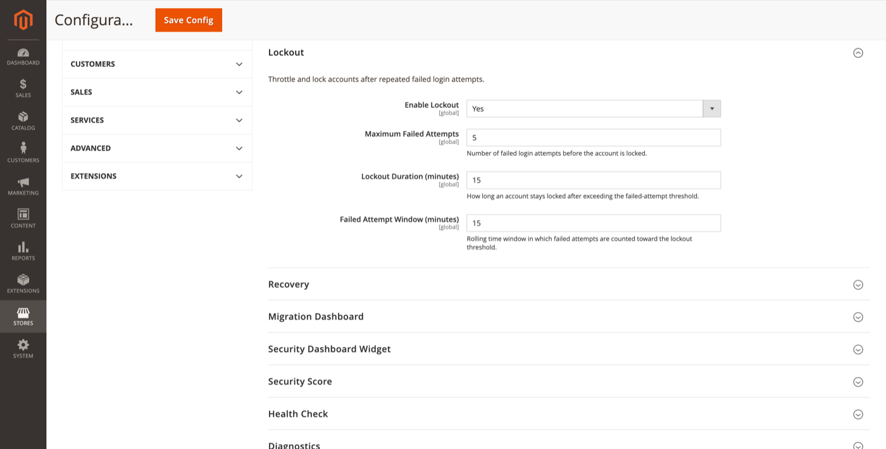

# Lockout

Throttle and lock administrator accounts after repeated failed login attempts.

**Path:** Stores → Configuration → Security → Admin Passkey → **Lockout**



## Settings

| Field | Default | Description |
|-------|---------|-------------|
| Enable Lockout | Yes | Enable brute-force throttling. |
| Maximum Failed Attempts | 5 | Failed attempts before the account is locked. |
| Lockout Duration (minutes) | 15 | How long the account stays locked after exceeding the threshold. |
| Failed Attempt Window (minutes) | 15 | Rolling window in which failed attempts count toward the threshold. |

## Admin UI

**Reports → Admin Passkey → Lockouts** shows currently locked accounts.

ACL: `FalconMedia_AdminPasskey::lockouts`

From this grid you can review lockout reason, timestamp, and unlock accounts manually.

## CLI

```bash
# List locked accounts
bin/magento adminpasskey:lockouts:list

# Unlock by username or ID
bin/magento adminpasskey:lockouts:unlock --username=admin
```

See [CLI commands](cli-commands.md).

## Notifications

When an account is locked, the [Lockout notification template](email-templates.md) can email the administrator (if configured).

## Fail2Ban

Failed login events are also written to the Fail2Ban-compatible log when enabled. See [Fail2Ban](fail2ban.md).

## Related topics

- [Security dashboard widget](security-dashboard-widget.md) — Active Lockouts and Failed Logins cards
- [Recovery](recovery.md) — emergency access when locked out entirely
