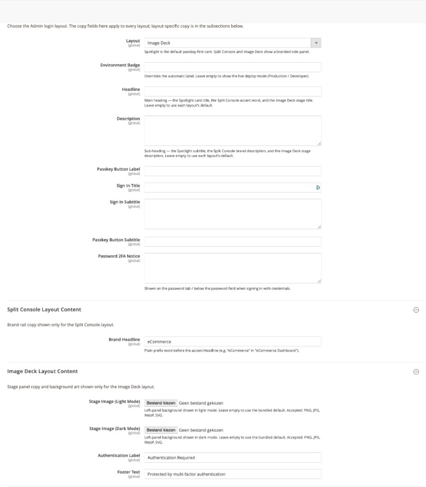

# Login Page Design

Choose the Admin login page layout and configure copy fields shared across all layouts. Layout-specific subsections appear below when the matching layout is selected.

**Path:** Stores → Configuration → Security → Admin Passkey → **Login Page Design**

## Layouts

| Layout | Description | Layout-specific subsection |
|--------|-------------|---------------------------|
| **Spotlight** (default) | Centered passkey-first card | — *(no extra subsection)* |
| **Split Console** | Branded left rail + sign-in panel | Split Console Layout Content |
| **Image Deck** | Stage panel with uploadable background art | Image Deck Layout Content |

## Shared fields

These fields apply to every layout. Leave empty to use each layout's built-in defaults.

| Field | Used as |
|-------|---------|
| Layout | Spotlight, Split Console, or Image Deck |
| Environment badge | Override for the automatic deploy-mode label (Production / Developer). Leave empty for live mode detection. |
| Headline | Spotlight card title, Split Console accent word, Image Deck stage title |
| Description | Spotlight subtitle, Split Console brand description, Image Deck stage description |
| Passkey button label | Primary passkey CTA text |
| Sign in title | Sign-in form heading (Split Console / Image Deck) |
| Sign in subtitle | Text under the sign-in title |
| Passkey button subtitle | Subtext below the passkey button |
| Password 2FA notice | Shown on the password tab or below the password field when signing in with credentials |

## Layout-specific subsections

| Layout | Subsection | Extra fields |
|--------|------------|--------------|
| Split Console | [Split Console Layout Content](split-console-layout.md) | Brand headline |
| Image Deck | [Image Deck Layout Content](image-deck-layout.md) | Stage images (light/dark), authentication label, footer text |

Spotlight uses only the shared fields above — there is no separate Spotlight subsection as of v1.0.1.

## Login page language

The login page locale is controlled separately under [General](general.md) → **Login Page Language**, not on this page.

## Theme support

All layouts support light, dark, and system theme modes. Admins can switch via the sun / monitor / moon toggle on the login page. See [Admin login](admin-login.md) for screenshots per layout and theme.

## Related topics

- [Spotlight layout](spotlight-layout.md) — default centered card
- [Split Console layout](split-console-layout.md) — branded side rail
- [Image Deck layout](image-deck-layout.md) — custom stage artwork
- [White label & branding](white-label-branding.md) — global accent colours and logo
- [Authentication policy](authentication-policy.md) — passkey-first behaviour
