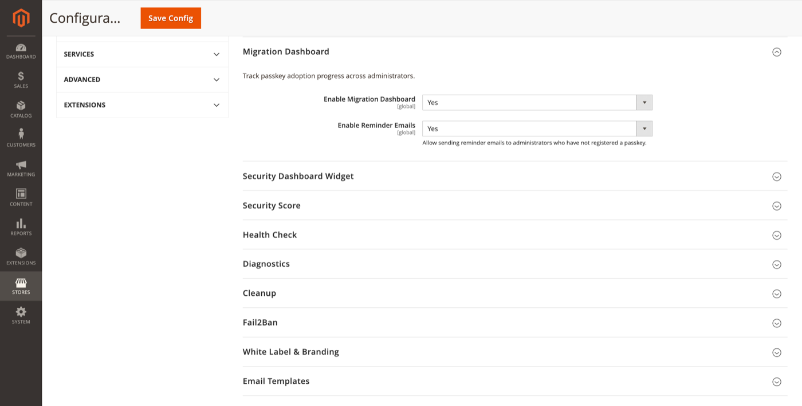

# Migration Dashboard

Track passkey adoption progress across administrators and send reminder emails.

**Path:** Stores → Configuration → Security → Admin Passkey → **Migration Dashboard**



## Configuration

| Field | Default | Description |
|-------|---------|-------------|
| Enable Migration Dashboard | Yes | Show the migration dashboard in Admin. |
| Enable Reminder Emails | Yes | Allow sending reminder emails to admins without a passkey. |

## Admin UI

**System → Admin Passkey → Migration Dashboard**

ACL: `FalconMedia_AdminPasskey::migration`

The dashboard typically shows:

- Total administrators vs. admins with at least one passkey
- Adoption percentage over time
- List of admins still on password-only authentication
- Actions to send individual or bulk reminder emails (when enabled)

Reminder emails use the [Passkey reminder template](email-templates.md).

## CLI

```bash
bin/magento adminpasskey:migration:status
```

Outputs adoption statistics suitable for CI or monitoring scripts.

## Rollout strategy

1. Enable the module with password fallback and 2FA still active ([Authentication policy](authentication-policy.md)).
2. Enable reminder emails; notify admins of the upcoming change.
3. Monitor adoption on the migration dashboard.
4. Optionally enable [Onboarding](onboarding.md) to require passkeys for holdouts.
5. Consider disabling password fallback only after adoption reaches your target.

## Related topics

- [Onboarding](onboarding.md) — force registration after login
- [Security dashboard widget](security-dashboard-widget.md) — Passkey Adoption card
- [Cleanup](cleanup.md) — reminder history retention
