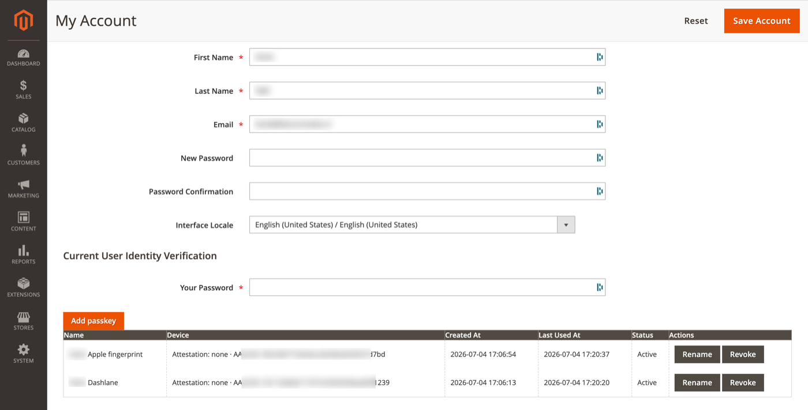

# My Account Passkeys

Manage passkeys from the standard Magento Admin account settings page.

**Path:** System → **My Account**

Passkeys are integrated into the existing account form — there is no separate menu item.

## Register a passkey

1. Open **System → My Account**.
2. Enter **Your Password** in the *Current User Identity Verification* field (required to authorize changes).
3. Click **Add passkey**.
4. Complete the WebAuthn ceremony and name the passkey in the wizard.

## Passkey table

| Column | Description |
|--------|-------------|
| Name | User-defined label |
| Device | Authenticator / attestation metadata |
| Created At | Registration timestamp |
| Last Used At | Most recent successful login with this passkey |
| Status | Active or revoked |
| Actions | **Rename**, **Revoke** |

## Rename

Updates the display name only. Does not affect the underlying WebAuthn credential.

## Revoke

Permanently disables the passkey. The credential cannot be used for login afterward. Revocation is recorded in the [audit log](admin-reports.md#audit-log).

> Revoke lost or compromised passkeys promptly. Ensure at least one other passkey or password fallback remains before revoking your last credential.

## ACL

Managing your own passkeys requires access to the Admin account page. Revoking or viewing other users' passkeys may require additional permissions depending on your Magento role setup.

## Related topics

- [Onboarding](onboarding.md) — mandatory first-time setup
- [Passkey setup wizard](passkey-setup-wizard.md) — registration UI
- [Trusted devices](trusted-devices.md) — browser trust separate from passkeys
