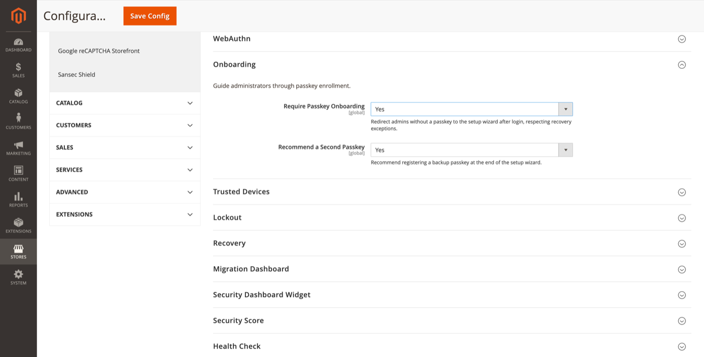

# Onboarding

Guide administrators through passkey enrollment after login.

**Path:** Stores → Configuration → Security → Admin Passkey → **Onboarding**

## Settings

| Field | Default | Description |
|-------|---------|-------------|
| Require Passkey Onboarding | Yes | Redirect admins without a passkey to the setup wizard after login, respecting [recovery](recovery.md) exceptions. |
| Recommend a Second Passkey | Yes | At the end of the wizard, recommend registering a backup passkey on another device. |

## Behaviour

When **Require Passkey Onboarding** is enabled:

1. Admin signs in (passkey or password).
2. If the account has zero registered passkeys, the admin is redirected to the [Passkey setup wizard](passkey-setup-wizard.md).
3. The wizard must be completed before normal Admin navigation is available (except during active [recovery](recovery.md) mode).

When **Recommend a Second Passkey** is enabled, the final wizard step suggests adding a backup passkey — for example on a phone or a second security key.

## Disabling onboarding

Set **Require Passkey Onboarding** to **No** if you want voluntary adoption only. Admins can still register passkeys via **System → My Account** or when prompted by the [Migration dashboard](migration-dashboard.md).

## Related topics

- [Passkey setup wizard](passkey-setup-wizard.md) — wizard steps and UI
- [My Account passkeys](my-account-passkeys.md) — manual registration outside the wizard
