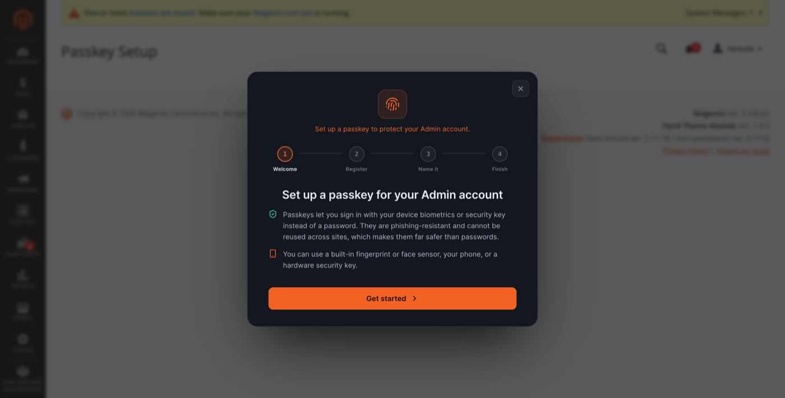

# Passkey Setup Wizard

Guided flow for registering a first (or additional) passkey after Admin login.

## Access

The wizard opens automatically when [Onboarding](onboarding.md) is enabled and the admin has no passkey. It is also reachable from **System → My Account** via **Add passkey**.

## Step 1 — Welcome

The wizard explains:

- Passkeys sign you in with device biometrics or a security key instead of a password.
- Passkeys are phishing-resistant and cannot be reused across sites.
- Supported authenticators: built-in fingerprint or face sensor, phone, or hardware security key.

Click **Get started** to continue.

## Step 2 — Register

The browser WebAuthn ceremony runs. Follow the OS or browser prompt to create a credential on the chosen authenticator.

## Step 3 — Name it

Give the passkey a descriptive name (e.g. *MacBook Touch ID*, *YubiKey 5*). This name appears in [My Account passkeys](my-account-passkeys.md) and audit logs.

## Step 4 — Finish

If [Recommend a Second Passkey](onboarding.md) is enabled, the wizard offers to register a backup passkey on another device. Otherwise the admin proceeds to the Admin dashboard.

## Troubleshooting

| Symptom | Check |
|---------|-------|
| WebAuthn prompt never appears | [WebAuthn](webauthn.md) rpId/origin, HTTPS, browser support |
| Ceremony times out | Increase ceremony timeout or challenge lifetime in WebAuthn config |
| Wizard loop after registration | Cache flush; verify passkey saved in My Account table |

Run `bin/magento adminpasskey:health` for a quick configuration check. See [Health check](health-check.md).
