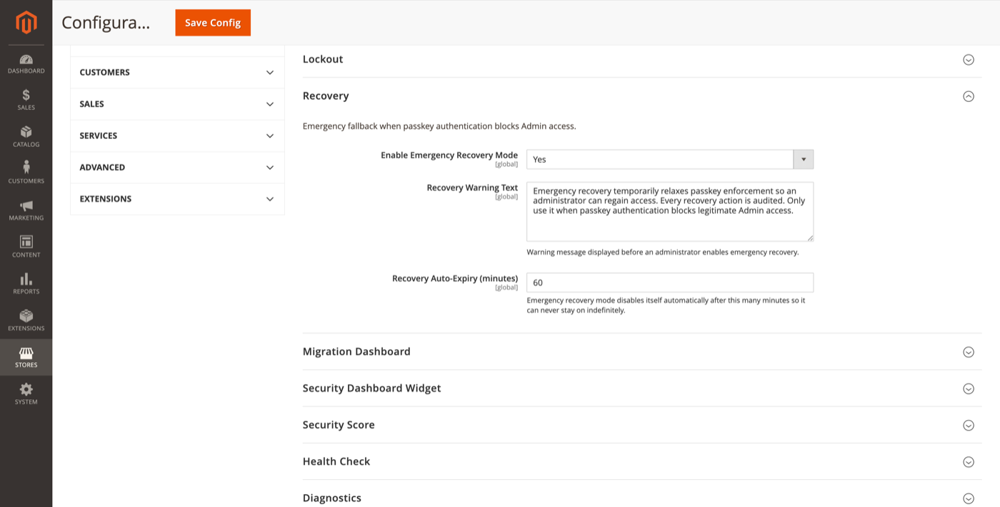

# Recovery

Emergency fallback when passkey authentication blocks legitimate Admin access.

**Path:** Stores → Configuration → Security → Admin Passkey → **Recovery**



## Settings

| Field | Default | Description |
|-------|---------|-------------|
| Enable Emergency Recovery Mode | Yes | Allow authorised admins to temporarily relax passkey enforcement. |
| Recovery Warning Text | *(see config)* | Warning shown before enabling recovery. |
| Recovery Auto-Expiry (minutes) | 60 | Recovery mode disables itself automatically after this duration. |

Default warning text:

> Emergency recovery temporarily relaxes passkey enforcement so an administrator can regain access. Every recovery action is audited. Only use it when passkey authentication blocks legitimate Admin access.

## Admin UI

**System → Admin Passkey → Recovery**

ACL: `FalconMedia_AdminPasskey::recovery`

From this page an authorised administrator can:

1. Read the configured warning text.
2. Enable emergency recovery mode (audited).
3. Monitor remaining time until auto-expiry.

Recovery does **not** stay enabled indefinitely — it expires after the configured minutes.

## CLI

```bash
# Check whether recovery mode is active
bin/magento adminpasskey:recovery:status

# Disable recovery mode immediately
bin/magento adminpasskey:recovery:disable
```

## Notifications

Enabling or disabling recovery triggers the [Recovery notification template](email-templates.md).

## When to use recovery

- All passkeys for an admin were lost or revoked and password fallback is disabled.
- WebAuthn misconfiguration (wrong rpId/origin) blocks all passkey logins.
- Onboarding redirect loop prevents access to configuration.

After recovery, fix the root cause ([WebAuthn](webauthn.md), re-register passkeys via [My Account](my-account-passkeys.md)), then confirm recovery is off.

## Related topics

- [Authentication policy](authentication-policy.md) — password fallback setting
- [Audit log](admin-reports.md#audit-log) — all recovery actions logged
- [Security dashboard widget](security-dashboard-widget.md) — Recovery Mode Status card
