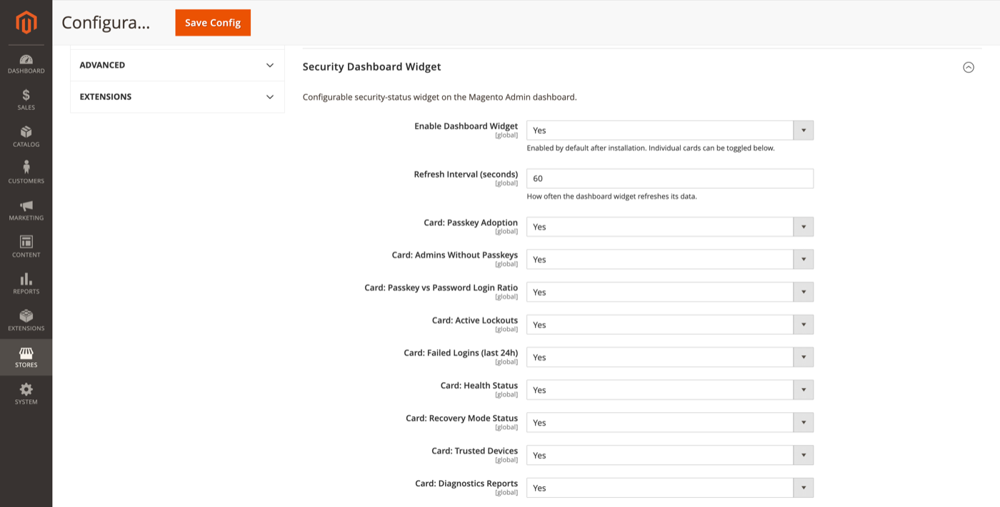

# Security Dashboard Widget

Configurable security-status widget on the Magento Admin dashboard.

**Path:** Stores → Configuration → Security → Admin Passkey → **Security Dashboard Widget**

## Settings

| Field | Default | Description |
|-------|---------|-------------|
| Enable Dashboard Widget | Yes | Show the widget on the Admin dashboard (enabled by default after install). |
| Refresh Interval (seconds) | 60 | How often the widget refreshes its data via AJAX. |

## Individual cards

Each card can be toggled independently:

| Card | Shows |
|------|-------|
| Passkey Adoption | Percentage of admins with passkeys |
| Admins Without Passkeys | Count still on password-only |
| Passkey vs Password Login Ratio | Login method split |
| Active Lockouts | Currently locked accounts |
| Failed Logins (last 24h) | Recent failure count |
| Health Status | Result of [health check](health-check.md) |
| Recovery Mode Status | Whether [recovery](recovery.md) is active |
| Trusted Devices | Trusted browser count |
| Diagnostics Reports | Pending or recent reports |

Disable cards you do not need to reduce dashboard noise and polling load.

## Permissions

Viewing the widget requires dashboard access plus `FalconMedia_AdminPasskey::admin_passkey` (or child resources for linked actions).

## Related topics

- [Security score](security-score.md) — separate weighted score engine
- [Health check](health-check.md) — data source for Health Status card
