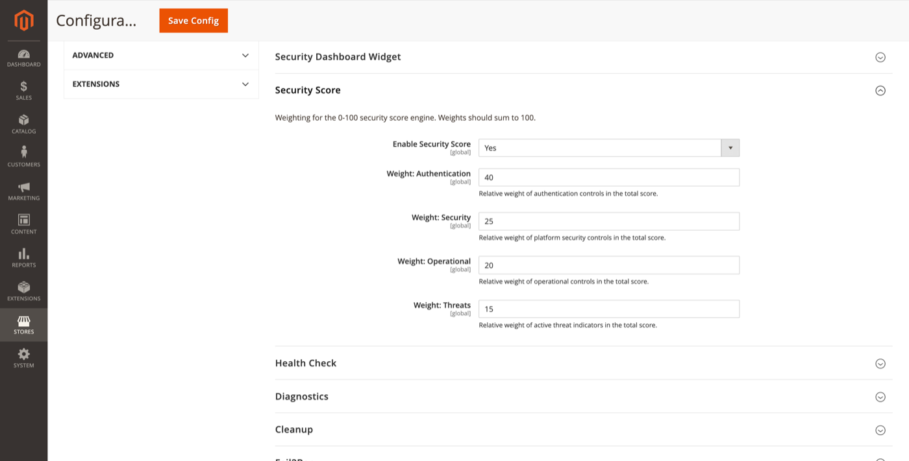

# Security Score

Weighted 0–100 security score engine based on configurable category weights.

**Path:** Stores → Configuration → Security → Admin Passkey → **Security Score**



## Settings

| Field | Default | Description |
|-------|---------|-------------|
| Enable Security Score | Yes | Calculate and display the security score. |
| Weight: Authentication | 40 | Relative weight of authentication controls. |
| Weight: Security | 25 | Relative weight of platform security controls. |
| Weight: Operational | 20 | Relative weight of operational controls. |
| Weight: Threats | 15 | Relative weight of active threat indicators. |

**Weights should sum to 100.** The engine normalises inputs from passkey adoption, 2FA status, lockouts, recovery state, health check results, and related signals.

## Admin UI

**Reports → Admin Passkey → Security Score**

ACL: `FalconMedia_AdminPasskey::security_score`

Shows the current score, category breakdown, historical trend (when snapshots exist), and recommendations.

## CLI

```bash
bin/magento adminpasskey:score
```

Prints the current score and component breakdown to stdout — useful for monitoring or cron-based alerting.

## Snapshots

Historical scores are retained according to [Cleanup](cleanup.md) → Security Score Snapshot Retention (default 90 days).

## Related topics

- [Security dashboard widget](security-dashboard-widget.md) — optional Health Status card
- [Health check](health-check.md) — feeds into the score
