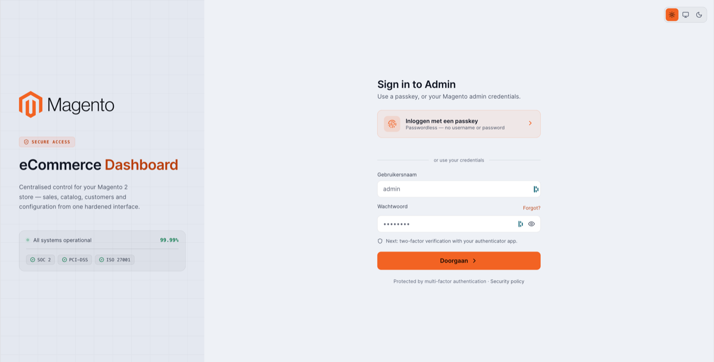
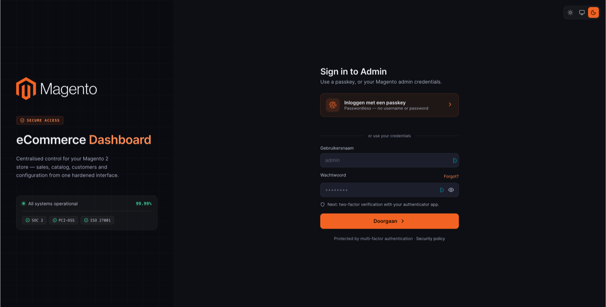

# Split Console Layout

A two-column login layout with a branded left rail and a sign-in panel on the right.

**Path:** Stores → Configuration → Security → Admin Passkey → **Login Page Design** → Layout: **Split Console**

The **Split Console Layout Content** subsection is visible only when Split Console is selected. See the full configuration page in [Login page design](login-page-design.md).

## Configuration fields

### Shared (Login Page Design)

| Field | Default (example) |
|-------|-------------------|
| Headline | Dashboard *(accent word in "eCommerce Dashboard")* |
| Description | Centralised control for your Magento 2 store — sales, catalog, customers and configuration from one hardened interface. |
| Passkey button label | *(layout default)* |
| Sign in title | Sign in to Admin |
| Sign in subtitle | Use a passkey, or your Magento admin credentials. |
| Passkey button subtitle | Passwordless — no username or password |
| Password 2FA notice | Next: two-factor verification with your authenticator app. |

### Split Console Layout Content

| Field | Default (example) |
|-------|-------------------|
| Brand headline | eCommerce *(plain prefix word before the accent Headline)* |

The left rail renders `{Brand headline} {Headline}` — e.g. *eCommerce Dashboard* when brand headline is `eCommerce` and headline is `Dashboard`.

## Login page preview

| Theme | Screenshot |
|-------|------------|
| Light |  |
| Dark |  |

The left rail shows the Magento logo, a secure-access badge, the combined brand headline, a system status widget, and compliance badges. The right panel leads with a passkey button, then optional username/password fields separated by an *or use your credentials* divider.

## When to use Split Console

Use when you want a professional, dashboard-style first impression with operational status messaging on the login screen without uploading custom artwork.
