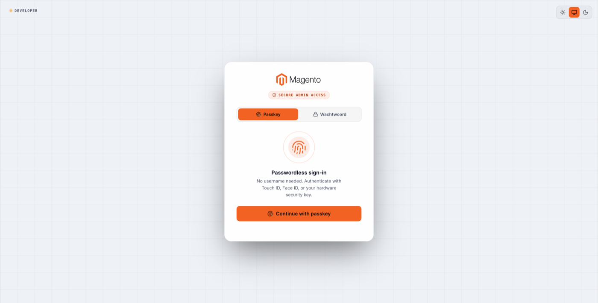
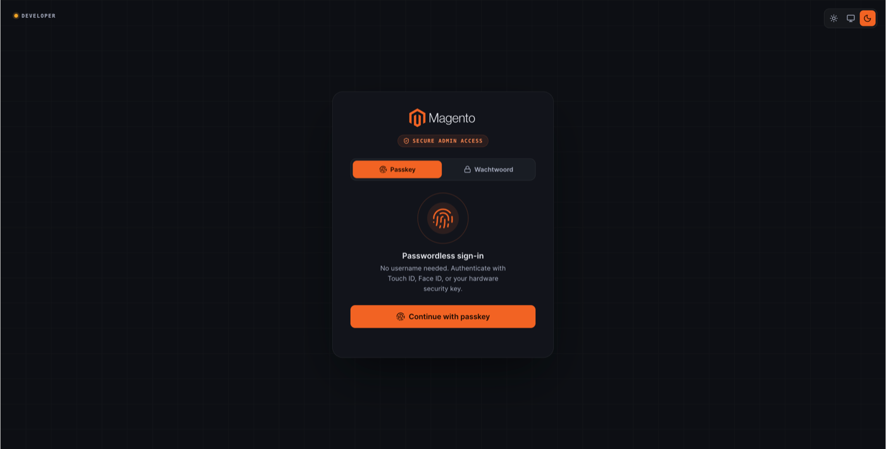
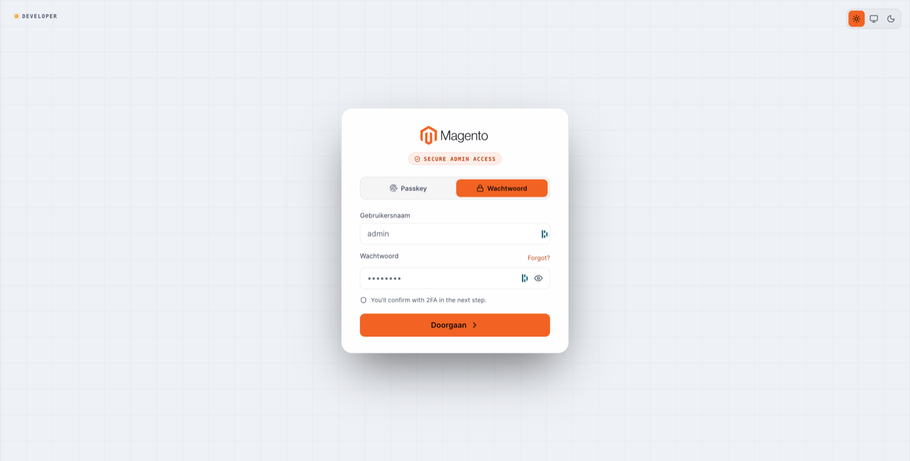
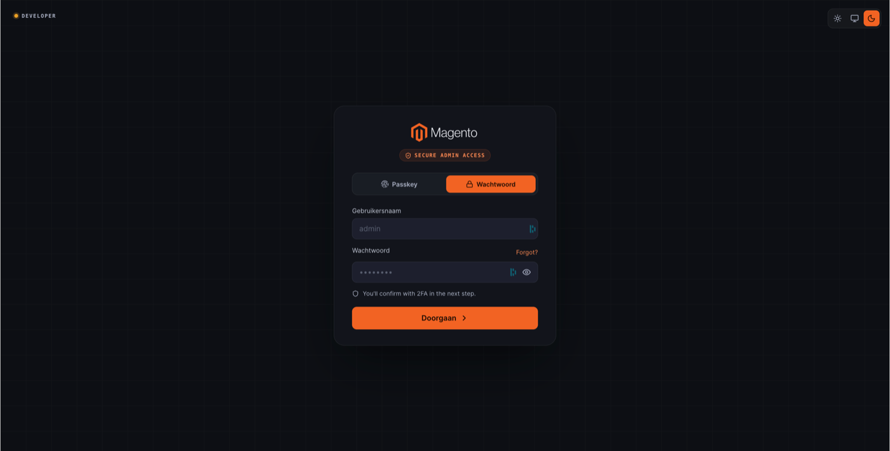

# Spotlight Layout

The default passkey-first login layout: a centered card with Passkey and Password tabs.

**Path:** Stores → Configuration → Security → Admin Passkey → **Login Page Design** → Layout: **Spotlight**

As of v1.0.1 there is no separate *Spotlight Layout Content* subsection. All Spotlight copy is configured via the shared fields on [Login page design](login-page-design.md).

## Configuration fields

Configure under **Login Page Design** (shared fields):

| Field | Default (example) |
|-------|-------------------|
| Headline | Passwordless sign-in |
| Description | No username needed. Authenticate with Touch ID, Face ID, or your hardware security key. |
| Passkey button label | Continue with passkey |
| Password 2FA notice | You'll confirm with 2FA in the next step. *(password tab only)* |

## Login page preview

### Passkey tab

| Theme | Screenshot |
|-------|------------|
| Light |  |
| Dark |  |

### Password tab

| Theme | Screenshot |
|-------|------------|
| Light |  |
| Dark |  |

Login labels follow [Login Page Language](general.md#login-page-language) (auto-detect or forced locale). Dutch screenshots show *Wachtwoord*, *Gebruikersnaam*, *Doorgaan*.

## When to use Spotlight

Best for a minimal, focused login experience without a branded side panel. Works well when you rely on [White label & branding](white-label-branding.md) for colours and logo rather than a full marketing rail.
