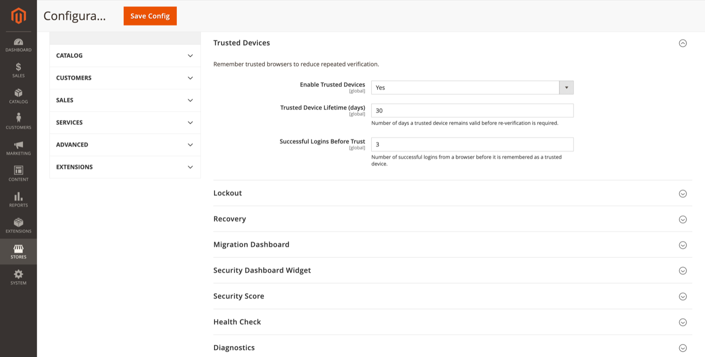

# Trusted Devices

Remember trusted browsers to reduce repeated verification after successful logins.

**Path:** Stores → Configuration → Security → Admin Passkey → **Trusted Devices**

## Settings

| Field | Default | Description |
|-------|---------|-------------|
| Enable Trusted Devices | Yes | Master switch for browser trust tracking. |
| Trusted Device Lifetime (days) | 30 | How long a trusted device remains valid before re-verification is required. |
| Successful Logins Before Trust | 3 | Number of successful logins from a browser before it is remembered as trusted. |

## Admin UI

**System → Admin Passkey → Trusted Devices** lists remembered devices per administrator. ACL: `FalconMedia_AdminPasskey::trusted_devices`.

Admins can review which browsers have been trusted and revoke trust when a device is lost or shared.

## How trust works

1. Admin logs in successfully (passkey or password + 2FA).
2. After the configured number of successful logins from the same browser fingerprint, the device is marked trusted.
3. Trusted devices may skip certain repeated verification steps within the lifetime window.
4. After the lifetime expires, the browser must re-establish trust through successful logins.

Trust is per browser / device, not per passkey. Passkey registration is separate — see [My Account passkeys](my-account-passkeys.md).

## Related topics

- [Security dashboard widget](security-dashboard-widget.md) — Trusted Devices card
- [Cleanup](cleanup.md) — expired trust record retention (via audit/challenge policies)
