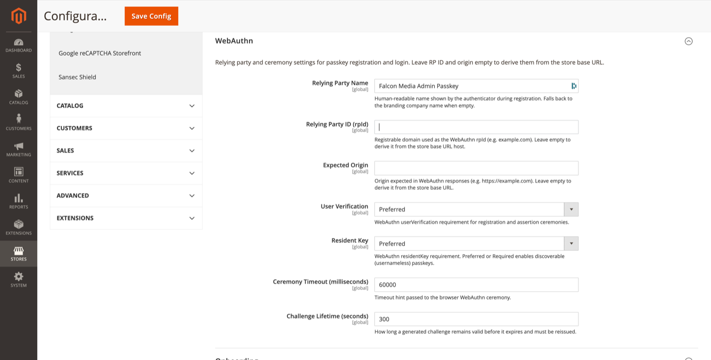

# WebAuthn

Relying party and ceremony settings for passkey registration and login.

**Path:** Stores → Configuration → Security → Admin Passkey → **WebAuthn**

Leave **Relying Party ID** and **Expected Origin** empty to derive them automatically from the store base URL — recommended for most single-host setups.

## Settings

| Field | Default | Description |
|-------|---------|-------------|
| Relying Party Name | Falcon Media Admin Passkey | Human-readable name shown by the authenticator during registration. Falls back to the [branding company name](white-label-branding.md) when empty. |
| Relying Party ID (rpId) | *(empty)* | Registrable domain for WebAuthn (e.g. `example.com`). Must match the host admins use to reach the Admin. |
| Expected Origin | *(empty)* | Origin expected in WebAuthn responses (e.g. `https://admin.example.com`). |
| User Verification | Preferred | WebAuthn `userVerification` requirement for registration and assertion. |
| Resident Key | Preferred | WebAuthn `residentKey` requirement. **Preferred** or **Required** enables discoverable (usernameless) passkeys. |
| Ceremony Timeout (ms) | 60000 | Timeout hint passed to the browser WebAuthn API. |
| Challenge Lifetime (seconds) | 300 | How long a server-generated challenge remains valid before reissue. |

## Multi-host and reverse-proxy setups

If Admin is served on a different hostname than the storefront, set **rpId** and **Expected Origin** explicitly to match the Admin URL. A mismatch causes WebAuthn ceremonies to fail with origin or rpId errors in the browser console.

## Related topics

- [Authentication policy](authentication-policy.md) — usernameless passkey login
- [Health check](health-check.md) — validates WebAuthn configuration
- [Cleanup](cleanup.md) — expired challenge retention
