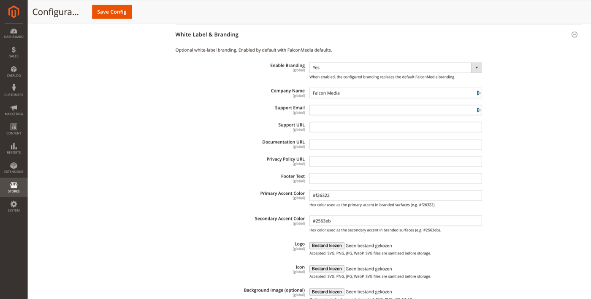

# White Label & Branding

Optional white-label branding for login, onboarding, and module surfaces.

**Path:** Stores → Configuration → Security → Admin Passkey → **White Label & Branding**

Branding is **enabled by default** with FalconMedia defaults. Disable or customise to match your agency or client identity.

## Settings

| Field | Description |
|-------|-------------|
| Enable Branding | When Yes, configured branding replaces default FalconMedia branding. |
| Company Name | Shown in WebAuthn RP name fallback and branded surfaces. |
| Support Email | Contact link in help contexts. |
| Support URL | External support portal URL. |
| Documentation URL | Link to your own docs (can point to this `docs/` folder when hosted). |
| Privacy Policy URL | Privacy policy link for compliance copy. |
| Footer Text | Custom footer on branded pages. |
| Primary Accent Color | Hex colour (default `#f26322`). |
| Secondary Accent Color | Hex colour (default `#2563eb`). |
| Logo | SVG, PNG, JPG, or WebP. SVG files are sanitised before storage. |
| Icon | Favicon / small mark. Same formats as logo. |
| Background Image (optional) | Optional global background (separate from [Image Deck](image-deck-layout.md) stage images). |

## Where branding applies

- Admin login page ([Login page design](login-page-design.md) layouts)
- [Passkey setup wizard](passkey-setup-wizard.md)
- Onboarding and recovery warning surfaces
- Email templates (where template variables reference branding)

## Tips

- Match primary accent to your client's brand guidelines; it drives buttons and highlights on the login page.
- Upload SVG logos for crisp rendering at all DPIs.
- Set **Documentation URL** to an internal wiki or the published version of this documentation set.

## Related topics

- [Login page design](login-page-design.md) — layout-specific copy overrides branding text
- [Email templates](email-templates.md) — transactional emails inherit store sender, not all branding fields
